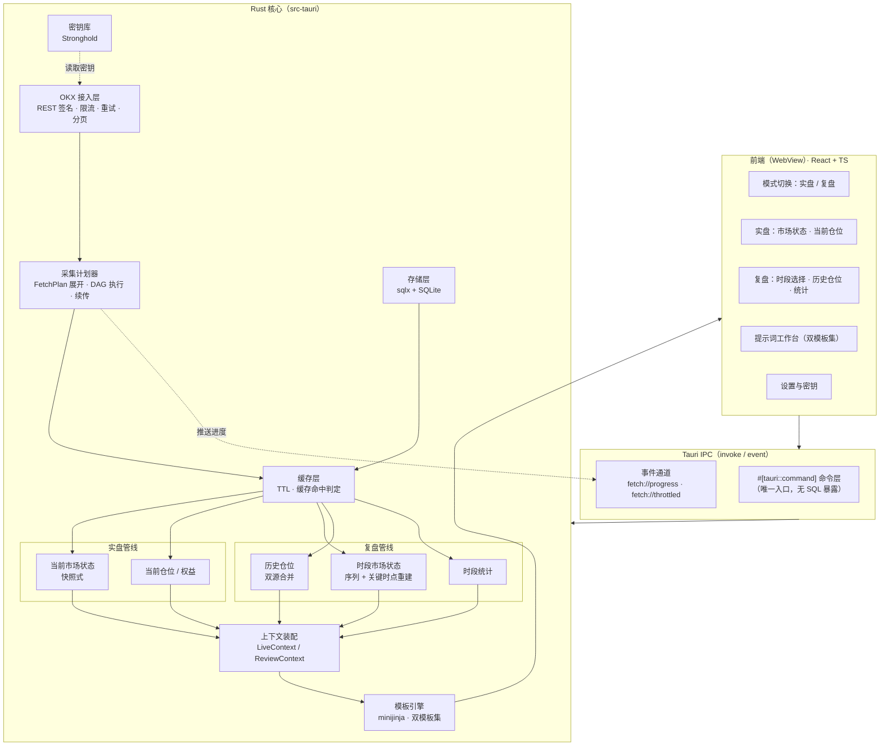
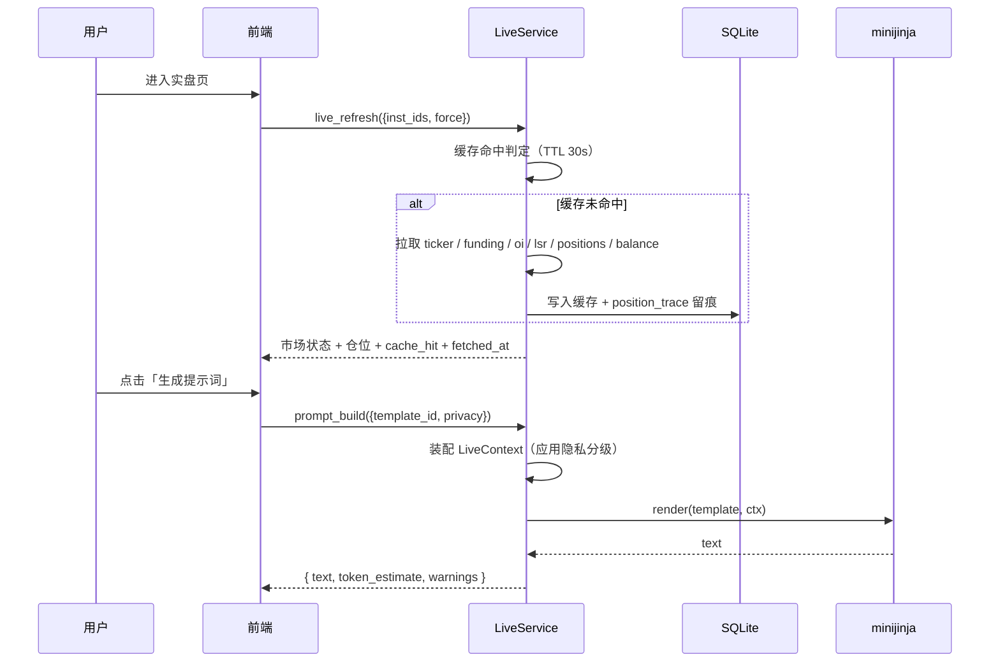
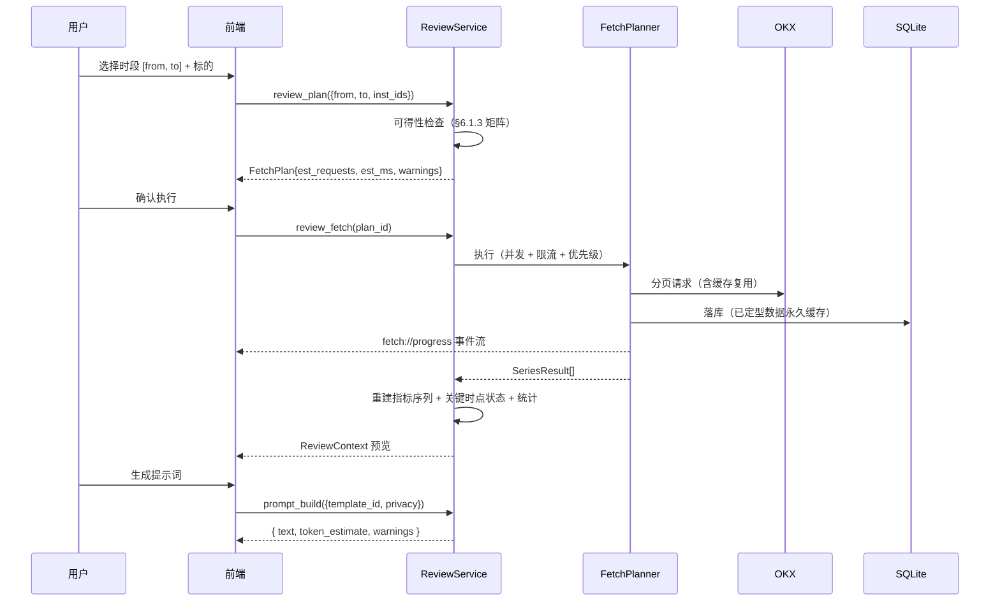

# MarketLens 设计文档

> **MarketLens**（`com.marketlens.app`）。一个把「OKX 市场状态 + 你的当前仓位 + 你的历史仓位」装配成结构化上下文、再用提示词模板渲染成 AI 提示词的多端工具。
>
> **核心形态：按需采集，无实时订阅。实盘与复盘是两个分离的工作流。**
>
> 版本：v1.0（设计定稿）｜日期：2026-09-25｜状态：**需求已确认，待实施**

---

## 1. 目标与非目标

### 1.1 目标

| # | 目标 | 可验收的形态 |
|---|---|---|
| G1 | **按需**抓取市场状态 | 用户打开实盘页时，一次性拉取一组标的的「价格 / 涨跌 / 资金费率 / 持仓量 / 多空比 / 主动买卖量 / 波动率 / 趋势状态」并展示 |
| G2 | 读取当前账户仓位 | 列出全部未平仓位（含逐仓/全仓、杠杆、均价、标记价、强平价、未实现盈亏、保证金率）与账户权益 |
| G3 | 读取历史仓位 | 合并「OKX 官方已平仓位记录」+「本地留痕」，可查询、可统计 |
| G4 | **按时段**重建历史市场状态 | 指定时间范围 → 拉取该时段的 K 线/资金费率/持仓量/多空比等 → 计算指标 → 还原「当时市场是什么样」 |
| G5 | 生成 AI 提示词 | 用可编辑模板把上述数据渲染成提示词文本；**实盘模板集与复盘模板集分离**，支持预览、复制、导出 |
| G6 | 双端可用 | Windows 桌面端 + Android 端，功能对等 |

### 1.2 非目标（本期明确不做）

- ❌ **不做实时行情**：不使用 WebSocket，不做常驻轮询，不维护长连接。所有数据在用户需要时按需拉取。
- ❌ **不做交易**：不含下单、撤单、改单、划转。API Key 只申请「读取」权限。
- ❌ **不托管**：无服务端、无账号系统，密钥与数据 100% 留本机。
- ❌ **不内置 LLM 调用**：只产出提示词文本，用户自行粘贴到任意 AI。
- ❌ **不做回测引擎**：历史统计只做描述性统计，不做策略回放。
- ❌ **不做多账户**：单用户、单 OKX 账户（可切换多个 API Key，但不做子账户聚合）。
- ❌ **不做预警通知**：无实时数据即无预警（这是「不要实时」的直接推论）。

### 1.3 两种模式

这是本版本最重要的结构变化——**实盘与复盘彻底分离**：

| | **实盘模式 (Live)** | **复盘模式 (Review)** |
|---|---|---|
| 时间视角 | 此刻 | 用户指定的过去时段 |
| 数据来源 | 当前值端点（ticker / positions / balance / funding-rate 当前值） | 历史端点（history-candles / funding-rate-history / rubik stat with begin-end） |
| 市场状态 | 当前快照 | **时段重建**：整段序列 + 关键时点状态 |
| 仓位 | 未平仓 | 已平仓（官方记录 + 本地留痕） |
| 上下文装配 | `LiveContext` | `ReviewContext`（含时段元数据、序列、逐仓开仓时点状态） |
| 模板集 | `live/*` | `review/*` |
| 典型问题 | 「我现在的持仓有什么风险？」 | 「上周那笔亏损，我入场时机错在哪？」 |
| 采集规模 | 10~30 个请求 | 30~300 个请求（需要进度条与取消） |

**共享的部分**：OKX 客户端、限流器、指标计算、SQLite、密钥库、模板引擎。**分离的部分**：采集计划、上下文装配、模板集、UI 页面。

> ✅ **已确认：单应用双模式**。安装一份、共用配置与密钥、切换成本为零。共享边界已画在 §5 的目录结构中，若将来确实要拆成两个独立应用，重构成本可控。

### 1.4 用户故事

1. 作为交易者，我打开应用进入**实盘**，看到当前仓位与此刻的市场状态，点「生成提示词」→ 得到一段文本，粘给 AI 问「我这些仓位现在有什么风险」。
2. 作为交易者，我要**复盘**上周的一笔亏损：进入复盘模式 → 选时段（上周一到周五）→ 应用拉取该时段的行情与我的平仓记录 → 渲染复盘模板，其中每笔仓位都**自动附带开仓时刻的市场状态** → 让 AI 分析我入场时机的问题。
3. 作为交易者，我不想让 AI 知道我账户的绝对金额：打开「隐私模式 L1」，金额自动百分比化。

---

## 2. 需求确认结果

| 决策项 | 结论 | 影响 |
|---|---|---|
| 技术栈 | **Tauri v2 + 前端框架** | Rust 后端承载全部业务逻辑；前端为薄视图层 |
| 功能边界 | **只读**：行情 + 仓位 + 复盘提示词 | 无交易签名、无下单链路；API Key 权限最小化 |
| 实时性 | **不需要实时行情，按需获取** | **取消 WS 与常驻轮询**；取消预警；取消后台调度器 |
| 模式划分 | **复盘与实盘分开** | 双模式、双上下文、双模板集、双采集路径 |
| 复盘数据范围 | **按时段获取所需数据** | 需要采集计划器、分页续传、进度反馈、时段重建能力 |
| 提示词生成 | **本地模板渲染，产出文本** | 后端集成模板引擎，无外部 API 依赖 |
| 密钥与数据 | **纯本地**：系统密钥库 + 本地 SQLite | 无服务端、无同步、无隐私外泄面 |
| 历史仓位数据源 | **官方接口 + 本地留痕** | 双源合并 + 去重策略（§6.4.3） |
| 应用名 / 包名 | **MarketLens** / `com.marketlens.app` | 已定稿，写入 `tauri.conf.json` 与 Android 签名配置 |
| 默认标的集 | **首次启动由用户自选**（预勾选 BTC/ETH/SOL） | 需新增首次启动引导流程（§6.9） |
| 复盘 K 线粒度 | **默认 1H**，可切换 | 720 根覆盖 30 天，请求量与信息量最均衡 |
| 复盘时段上限 | **90 天**（硬上限） | 时段选择器上限，超出由 `review_plan` 拒绝（§6.2.1） |
| 官方历史数据导入 | **本期不做，预留接口** | `imported_series` 表 + `import/` 模块边界（Phase 3） |
| 实盘快照留档 | **保留，永久** | `live_snapshot` 不设自动清理（§8） |
| 界面语言 | **仅中文，但不硬编码** | 界面文案集中 `strings.ts`；模板正文本身即集中管理（§6.6.4） |
| 模板引擎 | **minijinja（Jinja 风格）** | 嵌套遍历能力为复盘模板所必需 |
| Android 分发 | **自用 APK 为主，同时产出 AAB 备用** | 一条命令同时出两种产物；上架材料暂不准备 |
| 应用结构 | **单应用双模式** | 见 §1.3 |

> 以上为全部需求确认项。§16 风险章节中的原「开放问题」已全部关闭。

## 3. 总体架构

### 3.1 分层



### 3.2 关键架构原则

1. **前端零业务逻辑**：所有 OKX 调用、指标计算、SQL 查询、模板渲染都在 Rust 侧。好处：Win/Android 行为完全一致，模板输出逐字节相同。
2. **前端零数据库权限**：**不使用 `tauri-plugin-sql`**。该插件会把任意 SQL 执行能力暴露给 WebView，而我们的数据含账户与仓位信息——前端一旦被注入等于交出整个数据库。改为 Rust 内 `sqlx` 直连，前端只能调语义化命令。
3. **按需、无状态**：没有后台任务、没有定时器、没有长连接。应用不做任何「用户没要求」的网络请求。启动时**不自动联网**，直到用户触发。
4. **数据新鲜度必须可见**：任何展示的数据都带时间戳与来源（实时拉取 / 缓存）。**绝不静默展示陈旧数据**。缓存命中时 UI 明确标注「缓存于 X 分钟前」并提供刷新按钮。
5. **只读契约**：OKX 客户端不实现任何 `POST` 私有端点——代码层面就不存在下单能力。
6. **一切可配置**：TTL、并发上限、订阅标的、指标参数都落库，不硬编码。

---

## 4. 技术栈

| 层 | 选型 | 理由 |
|---|---|---|
| 应用框架 | **Tauri v2** | 单套 Rust 核心同时产出 Windows 与 Android 产物；官方插件生态覆盖 SQLite/加密库；包体积远小于 Electron |
| 后端语言 | **Rust 2021**（`rustc ≥ 1.77.2`，Stronghold 插件下限） | 强类型、无 GC、精确的并发与限流控制 |
| 异步运行时 | `tokio` + `reqwest`（rustls） | 原生 TLS，免去 Windows/Android 上的 OpenSSL 交叉编译地狱。**不引入 `tokio-tungstenite`**（无 WS） |
| 数据库 | **SQLite**（`sqlx`，`bundled` feature） | 单文件、零运维、跨端一致；`bundled` 免系统库依赖 |
| 密钥库 | **`tauri-plugin-stronghold`**（IOTA Stronghold，argon2 派生） | 官方文档标注 Windows / Android / iOS / Linux / macOS 全平台支持。⚠️ 备选 `keyring` crate 在 Android 上**不可用**：`keyring-rs` 无 Android 后端，`android-native-keyring-store` 需 JNI 手工初始化 app context，复杂度与风险都更高 |
| 模板引擎 | **`minijinja`** | Jinja2 风格（循环/条件/过滤器/继承），表达力足以写真正的复盘模板；纯 Rust，双端一致 |
| 前端 | **React 19 + TypeScript + Vite** | 生态最大；图表库与 Tauri 无关，切换成本低 |
| 样式 | **Tailwind CSS** | 双端响应式布局（桌面宽屏 / 手机窄屏）一套断点搞定 |
| 图表 | **`lightweight-charts`**（TradingView，canvas 渲染） | 体积小、渲染快、Android WebView 上流畅；复盘时需要叠加仓位开平点标记 |
| 状态管理 | **TanStack Query** | 数据来自 IPC 命令，天然是异步资源；缓存/失效语义与「按需拉取 + TTL」模型契合 |
| 打包 | Windows：`tauri build` → NSIS / MSI；Android：`tauri android build` → APK / AAB | 见 §14 |

> 前端框架是本设计里**唯一可低成本替换**的决策：前端只是视图，全部数据来自 Tauri 命令。偏好 Vue 3 或 Svelte 5 的话，替换成本约等于重写视图层，不动核心。

---

## 5. 目录结构

```
datemode/
├─ docs/
│  └─ DESIGN.md                 # 本文档
├─ src/                         # 前端（WebView）
│  ├─ main.tsx
│  ├─ modes/
│  │  ├─ live/                  # 实盘：市场状态 / 当前仓位
│  │  └─ review/                # 复盘：时段选择 / 历史仓位 / 统计
│  ├─ features/onboarding/      # 首次启动引导（建 vault → 录 Key → 选标的）
│  ├─ features/prompt/          # 提示词工作台（双模板集）
│  ├─ features/settings/
│  ├─ lib/
│  │  ├─ ipc.ts                 # 命令的类型化封装（唯一 IPC 出口）
│  │  ├─ strings.ts             # 全部界面文案集中于此（为将来 i18n 留口）
│  │  └─ types.ts               # 由 Rust 生成的类型（见 §7.4）
│  └─ styles/
├─ src-tauri/
│  ├─ Cargo.toml
│  ├─ tauri.conf.json
│  ├─ capabilities/default.json # 权限白名单：仅放行自定义命令
│  ├─ templates/                # 内置模板（编译期 include_str! 进二进制）
│  │  ├─ live/
│  │  │  ├─ daily_review.md.j2
│  │  │  └─ position_risk.md.j2
│  │  └─ review/
│  │     ├─ period_review.md.j2
│  │     └─ trade_postmortem.md.j2
│  ├─ migrations/               # sqlx 迁移（0001_init.sql ...）
│  └─ src/
│     ├─ lib.rs                 # Tauri builder / 插件注册 / 命令注册
│     ├─ error.rs
│     ├─ commands/              # #[tauri::command] 薄封装（参数校验 + 调服务）
│     ├─ okx/
│     │  ├─ client.rs           # REST 客户端（签名/限流/重试）
│     │  ├─ sign.rs             # HMAC-SHA256 + Base64 签名
│     │  ├─ paging.rs           # 游标分页（after/before）通用迭代器
│     │  ├─ models.rs           # 响应反序列化结构体
│     │  ├─ endpoints.rs        # 端点元数据（鉴权/限流/分页方式/历史窗口）
│     │  └─ ratelimit.rs        # 令牌桶
│     ├─ fetch/
│     │  ├─ plan.rs             # FetchPlan 展开
│     │  ├─ executor.rs         # DAG 执行 + 并发控制 + 取消
│     │  └─ cache.rs            # TTL 缓存判定
│     ├─ market/
│     │  ├─ live.rs             # 当前市场状态快照
│     │  ├─ historical.rs       # 时段序列拉取
│     │  ├─ indicators.rs       # EMA/RSI/ATR/已实现波动率/基差
│     │  ├─ regime.rs           # 状态分类
│     │  └─ reconstruct.rs      # 关键时点状态重建（用于复盘逐仓归因）
│     ├─ position/
│     │  ├─ current.rs          # 当前仓位
│     │  ├─ history.rs          # 官方历史仓位同步
│     │  ├─ trace.rs            # 本地留痕（顺带记录）
│     │  └─ merge.rs            # 双源合并/去重/统计
│     ├─ prompt/
│     │  ├─ live_ctx.rs         # LiveContext 装配
│     │  ├─ review_ctx.rs       # ReviewContext 装配
│     │  ├─ privacy.rs          # 隐私分级
│     │  ├─ render.rs           # minijinja 渲染 + 自定义过滤器
│     │  └─ tokens.rs           # token 估算
│     ├─ storage/
│     │  ├─ db.rs               # 连接池、迁移
│     │  └─ repo/
│     └─ vault.rs               # Stronghold 封装
└─ android/                     # tauri android init 生成
```

> 注意：**没有 `scheduler.rs`、没有 `ws.rs`**。这是「不要实时」的直接体现。

---

## 6. 核心模块设计

### 6.1 OKX 接入层

#### 6.1.1 鉴权（已验证的官方规则）

私有端点需要 4 个头：

| Header | 值 |
|---|---|
| `OK-ACCESS-KEY` | API Key |
| `OK-ACCESS-SIGN` | `base64(HMAC-SHA256(secretKey, prehash))` |
| `OK-ACCESS-TIMESTAMP` | Unix 秒（或 ISO-8601 UTC，如 `2026-09-25T00:00:00.000Z`） |
| `OK-ACCESS-PASSPHRASE` | 创建 Key 时设置的 passphrase |

```
prehash = timestamp + method.to_uppercase() + requestPath + body
requestPath 包含 query string，但不含域名
```

**必须处理的坑**：

- 时间戳不同步会报 `50102`（timestamp expired）。每次私有请求前若本地时钟偏移 > 30s，UI 顶部警示。
- 时间戳格式必须与签名时使用的字符串**逐字节一致**——统一用 ISO-8601 毫秒格式，避免「秒 vs 毫秒」混用。
- 模拟盘：请求头 `x-simulated-trading: 1`，做成凭据属性 `env: live | demo`，方便无风险联调。

#### 6.1.2 端点清单

**公开端点**

| 用途 | 端点 | 历史窗口 | 模式 |
|---|---|---|---|
| 全市场行情 | `GET /api/v5/market/tickers?instType=SWAP` | 仅当前 | Live |
| 单标的行情 | `GET /api/v5/market/ticker` | 仅当前 | Live |
| K 线（近期） | `GET /api/v5/market/candles` | 近期，`limit ≤ 300` | Live |
| **K 线（历史）** | `GET /api/v5/market/history-candles` | 完整，`limit ≤ 100`，游标 `after`/`before` | Review |
| **标记价 K 线（历史）** | `GET /api/v5/market/history-mark-price-candles` | 完整 | Review |
| **指数 K 线（历史）** | `GET /api/v5/market/history-index-candles` | 完整 | Review |
| 标记价（当前） | `GET /api/v5/public/mark-price?instType=SWAP` | 仅当前 | Live |
| 资金费率（当前） | `GET /api/v5/public/funding-rate` | 仅当前（含预测值） | Live |
| **资金费率（历史）** | `GET /api/v5/public/funding-rate-history` | **近 3 个月**，`limit ≤ 100`，游标 `after`/`before`（基于 `fundingTime`，新→旧排序） | Review |
| 持仓量（当前） | `GET /api/v5/public/open-interest?instType=SWAP` | 仅当前 | Live |
| 持仓量 5s 序列 | `GET /api/v5/market/open-interest` | **仅近期** | Live |
| **多空账户比（历史）** | `GET /api/v5/rubik/stat/contracts/long-short-account-ratio?ccy=BTC` | **2023-06-09 起**，`begin`/`end`（ms，闭区间），默认 1m 粒度 | Review |
| **持仓量/成交额（历史）** | `GET /api/v5/rubik/stat/contracts/open-interest-volume?ccy=BTC` | **2023-06-09 起**，同上 | Review |
| **主动买卖量（历史）** | `GET /api/v5/rubik/stat/taker-volume?ccy=BTC&instType=SWAP` | **2023-06-09 起**，同上 | Review |
| 合约信息 | `GET /api/v5/public/instruments?instType=SWAP` | 仅当前（**必须拿 `ctVal`**） | 两者 |
| 深度 | `GET /api/v5/market/books` | **无历史** | Live |

**私有端点（只读）**

| 用途 | 端点 | 窗口 |
|---|---|---|
| 账户配置 | `GET /api/v5/account/config` | 当前（含 `posMode`） |
| 余额/权益 | `GET /api/v5/account/balance` | 当前 |
| **当前仓位** | `GET /api/v5/account/positions` | 当前 |
| **历史仓位** | `GET /api/v5/account/positions-history` | 官方保留窗口，`limit ≤ 100`，游标 `after`/`before` |
| 成交明细（近 3 天） | `GET /api/v5/trade/fills` | 3 天 |
| 成交明细（近 3 月） | `GET /api/v5/trade/fills-history` | 3 个月 |
| 账单流水 | `GET /api/v5/account/bills-archive` | 归档 |

> `posMode` 必须读取：净持仓模式下 `posSide` 恒为 `net`，长空模式才有 `long`/`short`。历史展示与统计都要按它分支。

#### 6.1.3 指标历史可得性矩阵 ⭐

**这是复盘模式的地基。** 不是所有指标都能还原到过去——必须对用户诚实：

| 指标 | 历史可得性 | 数据源 | 备注 |
|---|---|---|---|
| 价格 OHLCV | ✅ 完整 | `history-candles` | |
| 标记价 | ✅ 完整 | `history-mark-price-candles` | |
| 指数价 | ✅ 完整 | `history-index-candles` | |
| **基差** `(mark-index)/index` | ✅ 可重建 | 上面两者组合 | 复盘判断「当时多头溢价多少」的核心 |
| 资金费率 | ⚠️ **仅近 3 个月** | `funding-rate-history` | 更早需官方历史数据下载（见下） |
| 多空账户比 | ⚠️ **仅 2023-06-09 起** | `rubik/stat/...` | 默认 1m 粒度 |
| 持仓量 / 成交额 | ⚠️ **仅 2023-06-09 起** | `rubik/stat/...` | |
| 主动买卖量 | ⚠️ **仅 2023-06-09 起** | `rubik/stat/...` | |
| 持仓量 5s 序列 | ❌ 无历史 | – | 只有近期 |
| 订单簿深度 | ❌ 无历史（API） | – | 官方有 L2 历史文件下载（2023-03 起），体量巨大 |
| 成交量/波动率 | ✅ 可从 K 线算 | `history-candles` | 本地计算，不额外请求 |

**超出 API 窗口的路径（Phase 3 可选）**：OKX 提供历史数据下载门户，含资金费率（2022-03 起）、L2 订单簿（2023-03 起）、借币利率（2021-12 起）等。设计上预留「导入本地数据文件」的入口（`import/` 模块 + `imported_series` 表），本期不实现，但表结构与 `metric_series` 兼容，将来接入不需要重构。

**UI 上的体现**：复盘时段选择器会**动态提示可得性**。用户选了 2024 年 1 月的区间，若资金费率已超出 API 保留窗口，界面直接标注「资金费率：该时段数据不可得（超出 OKX 保留窗口）」，并且**复盘上下文里对应字段为 `null`，模板渲染时明确显示「数据不可得」而不是留空**——AI 看到空白会自行编造，看到「不可得」才会谨慎。

#### 6.1.4 限流

用**令牌桶 + 按端点分组**，因为 OKX 的限流规则既有按 IP 的也有按 User ID 的。

| 分组 | 作用域 | 初始值 | 来源 |
|---|---|---|---|
| `public.candles` | IP | 20 req / 2s | **保守初值**。官方对 `market/candles` 标注 40 req/2s per IP，但各行情端点数值不一 |
| `public.funding_history` | IP + Instrument | 10 req / 2s | 已确认 |
| `public.rubik` | IP | 5 req / 2s | 已确认 |
| `public.instruments` | IP | 20 req / 2s | 保守初值，低频且有缓存兜底 |
| `private.account` | User ID | 8 req / 2s | **保守初值**（低于公开可查的 10 req/2s 上限） |

> ⚠️ **实现时必须逐端点核对官方文档的 Rate Limit 小节**。搜索到的 `history-candles` 数值互相矛盾（20/2s vs 40/2s），本文档不采信任何未从官方页面直接确认的数字。做法：`endpoints.rs` 里每个端点携带 `rate_limit: RateLimit { scope, quota, window }` 元数据，初值取保守值，核对文档后改常量即可，逻辑不动。

**退避**：`429` 或 `5xx` → 指数退避 + 抖动（`min(2^n × 200ms, 30s) × (0.5~1.0)`），最多 4 次；连续 3 次 429 → 该分组冷却 60s 并推送 `fetch://throttled` 事件。

**因为按需采集，突发流量集中在复盘拉取**——这是限流器最重要的场景（见 §6.2.2）。

---

### 6.2 采集计划器（FetchPlan）

复盘要拉几百个请求，这是新增的核心模块。

#### 6.2.1 计划展开

```rust
pub struct FetchPlan {
    pub id: String,
    pub mode: Mode,                    // Live | Review
    pub from: Option<i64>,             // Review 才有时段
    pub to: Option<i64>,
    pub tasks: Vec<Series>,            // 原子「序列」列表
    pub est_requests: usize,
    pub est_duration_ms: u64,
    pub warnings: Vec<AvailabilityWarning>,  // 时段超出可得窗口的提示
}

/// 一条序列 = 一串分页请求（顺序依赖）
pub struct Series {
    pub endpoint: EndpointId,
    pub params: ParamMap,
    pub inst_id: Option<String>,
    pub pages: PagePlan,               // Cursor{after,before} | Range{begin,end} | Single
    pub priority: u8,                  // 1=关键 2=重要 3=锦上添花
}

/// 执行时展开为 DAG：序列内顺序，序列间并发
pub struct SeriesResult {
    pub series: Series,
    pub points: Vec<SeriesPoint>,
    pub status: SeriesStatus,          // Complete | Partial{cursor} | Failed{err} | Unavailable{reason}
}
```

**展开示例**（具体算例，用于验证设计）：

> 复盘 `BTC-USDT-SWAP` / `ETH-USDT-SWAP` 近 30 天，1 小时 K 线：
> - K 线：720 根 / 100（`history-candles` 上限）= **8 页/标的** → 16 请求
> - 标记价 + 指数价：各 8 页/标的 → 32 请求
> - 资金费率：30 天 × 3 次/天 = 90 条 → 1 页/标的 → 2 请求
> - Rubik 三项统计：1 请求/标的/项 → 6 请求
> - 仓位与成交：约 5~15 请求
> - **合计约 61~71 请求**，在 20 req/2s 的桶下约 **7 秒**完成
>
> 这个量级完全不需要实时订阅——用户点一次、等几秒、拿到完整上下文，比常驻长连接更符合「复盘」这个使用场景。

**时段上限校验**：`review_plan` 强制校验 `to - from ≤ 90 天`（已确认的硬上限），超出直接返回 `AppError::RangeTooLarge` 并在 UI 提示。同时按 bar 校验页数：若估算请求数 > 800，返回警告并建议改用更大 bar（如 1H → 4H），由用户确认后继续——**绝不静默截断时段**（静默截断会让用户以为看全了，是最危险的行为）。

#### 6.2.2 执行器

- **并发模型**：每条 `Series` 一个 `tokio` 任务；`Series` 之间并发，`Series` 内部因游标依赖而顺序执行。全局 `Semaphore`（默认 4）限制在途请求数。
- **优先级调度**：`priority=1`（K 线、仓位）先跑，让用户尽快看到主体内容；`priority=3` 失败不影响整体成功。
- **进度反馈**：每完成一页推送 `fetch://progress {plan_id, done, total, current_series}`，前端显示进度条。
- **取消**：`fetch_cancel(plan_id)` → 通过 `CancellationToken` 中止；已落库的部分数据保留（下次复用）。
- **断点续传**：序列的部分结果连同游标写入 `fetch_state`；同一时段的重复请求直接复用已完成的序列。
- **部分失败**：任一序列失败不使整个计划失败——`SeriesResult.status = Failed`，上下文里该字段标注不可得，并在 `warnings[]` 汇总。**复盘不能因为一个统计接口挂了就整体不可用。**

#### 6.2.3 缓存策略

| 数据 | TTL | 理由 |
|---|---|---|
| 已收盘 K 线（`confirm=1`） | **永久** | 数据已定型，永不再变 |
| 未收盘 K 线（`confirm=0`） | 不缓存 | 会变 |
| 历史资金费率（已结算记录） | 永久 | 已定型 |
| Rubik 统计（过去的时间点） | 永久 | 已定型 |
| 当前仓位 / 权益 | **30s** | 防止连点刷新打爆限流 |
| 当前市场状态（ticker / 当前资金费率） | **30s** | 同上 |
| 历史仓位（`positions-history`） | 6h + 手动强制刷新 | 平仓记录可能补录 |
| 合约信息（`ctVal`） | 24h | 极少变 |

- 所有 `*_fetch` 命令都接受 `force: bool` 绕过 TTL（对应 UI 的「强制刷新」按钮）。
- 缓存命中时，返回结构带 `cache_hit: true` 与 `fetched_at`，**UI 必须展示**。
- 「已定型数据永久缓存」是本设计的红利：**用户复盘过一次的时段，第二次几乎是瞬时的**，且离线可用。

---

### 6.3 市场状态引擎

#### 6.3.1 单标的指标

| 指标 | 定义 |
|---|---|
| `changePct` | 区间（Live=24h，Review=用户时段）涨跌幅 |
| `ema20 / ema60 / ema200` | 收盘价 EMA（`α = 2/(n+1)`） |
| `rsi14` | Wilder 平滑 |
| `atr14Pct` | `ATR14 / close` |
| `realizedVol` | 对数收益率样本标准差 × `√(年化周期数)` |
| `fundingCurrent` / `fundingAvg` | 当前（或时段末）与时段均值；`fundingAnnualized = funding × 3 × 365`（8h 结算 → 日 3 次） |
| `oiChangePct` | 持仓量区间变化率 |
| `basisPct` | `(markPx - indexPx) / indexPx`（**历史可重建**，见 §6.1.3） |
| `longShortRatio` | Rubik 多空账户比 |
| `takerBuySellRatio` | 主动买量 / 主动卖量 |
| `volumeVsAvg` | 区间成交额 / 前 20 期均值 |

#### 6.3.2 状态分类

```rust
pub enum TrendRegime { Uptrend, Downtrend, Range, Transition }
pub enum VolRegime   { Low, Normal, High, Extreme }
pub enum Crowding    { LongCrowded, ShortCrowded, Balanced }
```

判定规则（参数可配置，落 `settings` 表）：

- **趋势**：`ema20 > ema60 > ema200` 且 `close > ema20` → `Uptrend`；反向 → `Downtrend`；`|ema20-ema60|/close < 0.5%` 且价格在 `ema200` 上下 1.5% 内 → `Range`；其余 → `Transition`。
- **波动**：以 `realizedVol` 的历史分位（近 90 天）划分——`<25%` Low，`25%~75%` Normal，`75%~95%` High，`>95%` Extreme。
- **拥挤**：`fundingAnnualized > 30%` 或 `longShortRatio > 2.0` → `LongCrowded`；对称反向 → `ShortCrowded`；否则 `Balanced`。

同时输出**规则触发说明**（`signals: Vec<String>`，如 `"资金费率年化 +42%，多头拥挤度偏高"`）。AI 需要的是「为什么」，不只是「是什么」。

#### 6.3.3 实盘 vs 复盘的状态表示

| | 实盘 | 复盘 |
|---|---|---|
| 表示 | **单点快照** `MarketState` | **序列 + 关键时点** |
| 内容 | 此刻全部指标 + 分类 + signals | 时段内每根 K 线的指标序列；时段起点/终点/极值点状态 |
| 用途 | 「现在什么情况」 | 「这段时间发生了什么」+ 逐仓归因 |

#### 6.3.4 关键时点重建 ⭐

复盘最有价值的能力：**把每笔历史仓位与它开仓时刻的市场状态绑定**。

```
对每笔已平仓位 p：
  窗口 = [p.open_time - 24h, p.open_time]
  从本地缓存/API 取该窗口的 K 线 + 可得指标
  计算该窗口末的指标与 regime → p.regime_snapshot
```

结果：可以回答「**我在震荡市做趋势单的胜率是多少**」「我在资金费率极端时开多单的盈亏比是多少」——这是「市场状态」与「历史仓位」真正咬合的地方，也是这个工具区别于普通交易日志的核心价值。

若某指标在该时段不可得（如超出 Rubik 窗口），`regime_snapshot` 对应字段为 `null`，统计时该维度标注「样本不足」。

---

### 6.4 仓位服务

#### 6.4.1 当前仓位

`GET /api/v5/account/positions` → 标准化：

```rust
pub struct Position {
    pub inst_id: String,
    pub pos_side: String,        // long | short | net
    pub mgn_mode: String,        // cross | isolated
    pub lever: f64,
    pub contracts: f64,
    pub size_base: f64,          // contracts × ctVal（用 instruments 表换算）
    pub avg_px: f64,
    pub mark_px: f64,
    pub liq_px: Option<f64>,
    pub upl: f64,
    pub upl_ratio: f64,
    pub mgn_ratio: Option<f64>,
    pub notional_usd: f64,
    pub created_at: i64,
    pub updated_at: i64,
}
```

**关键细节**：张数 → 币数量必须用 `instruments.ct_val`，且 `ctValCcy` 可能不是计价币（币本位合约）。USD 名义价值按 `instType` 分支计算（U 本位用 `markPx`，币本位用 `markPx × 指数价`）。**换算错误会直接给 AI 喂错数据**，必须有单元测试覆盖两种合约。

#### 6.4.2 本地留痕（原「增量快照」的调整）

**变化说明**：原设计是「后台定时快照」，现在没有后台任务了。改为**顺带留痕**：

> 每次用户在实盘模式拉取当前仓位时（这本来就要发一次请求），**顺手把结果写一条 `position_trace`**。零额外网络请求、零额外 API 配额。

| 特性 | 说明 |
|---|---|
| 触发时机 | 用户打开实盘页 / 手动刷新时 |
| 成本 | **零**（复用已拉取的响应） |
| 覆盖度 | 只覆盖「用户打开过应用」的时刻 |
| 间隙 | 明确记录并在统计时标注——`position_trace` 有 `gap_before` 标记 |
| 价值 | 提供官方接口拿不到的信息：持仓期间的**最大浮盈/最大浮亏**（逐次留痕取极值） |

**对用户诚实**：复盘统计页展示「本地留痕覆盖度：本时段内共 12 次记录，存在 3 段间隙」，让用户自己判断样本可信度。

#### 6.4.3 历史仓位：双源合并

**源 A — 官方接口** `positions-history`：已平仓位，含开仓均价、平仓均价、已实现盈亏、盈亏率、手续费、资金费、开平仓时间。精确，但窗口有限。

**源 B — 本地留痕**：通过比对相邻两次留痕推导生命周期：

| 变化 | 判定 |
|---|---|
| `posId` 首次出现 | 仓位开立 |
| 存在且 `sz` 增大 | 加仓 |
| 存在且 `sz` 减小但 > 0 | 减仓 |
| `posId` 消失 | 平仓 |

**合并算法**（`position/merge.rs`）：

```
1. 以 posId 为键（OKX 的 posId 全局唯一）建索引。
2. 源 A 记录 → 写入 position_history，source='okx'。
3. 源 B 推导出、posId 不在源 A 中的 → source='local'。
4. posId 两源都有 → 保留源 A（更精确），本地记录只补充源 A 缺失的字段
   （如持仓期间最大浮盈/浮亏）。
5. 无 posId 的历史（净持仓模式部分场景）→ 退化为
   (instId, posSide, openTime ± 间隙) 模糊匹配；命中则合并，否则并列展示并标注「时间不精确」。
6. 每次同步写 fetch_state 游标，保证可续传。
```

**UI 必须透明**：每条历史仓位带来源角标 `官方` / `本地` / `官方+本地`，以及时间精度 `精确` / `近似`。数据可信度是复盘结论的地基，不能糊。

#### 6.4.4 统计

| 指标 | 定义 |
|---|---|
| 胜率 | `pnl > 0` 笔数 / 总笔数 |
| 盈亏比 | `avg(盈利笔 pnl) / abs(avg(亏损笔 pnl))` |
| 期望值 | `Σpnl / 笔数` |
| 平均持仓时长 | `avg(closeTime - openTime)` |
| 费用侵蚀 | `Σ(fee + fundingFee) / Σ|pnl|` |
| 聚合维度 | 标的 / 方向 / 月份 / 杠杆区间 / **开仓时的市场状态**（最有价值） |

---

### 6.5 密钥库

```rust
pub trait Vault {
    fn unlock(&self, password: &str) -> Result<()>;
    fn lock(&self) -> Result<()>;
    fn is_unlocked(&self) -> bool;
    fn put(&self, key: &str, value: &str) -> Result<()>;
    fn get(&self, key: &str) -> Result<Option<String>>;
    fn delete(&self, key: &str) -> Result<()>;
}
```

- 后端：`tauri-plugin-stronghold`，argon2 密码派生，vault 文件位于 `app_local_data_dir()/vault.hold`。
- **只从 Rust 侧调用**：插件的 JS 命令在 `capabilities/default.json` 里**不放行**，避免 WebView 直接读写密钥。
- 存储布局：`cred:{uuid}` → JSON `{api_key, secret_key, passphrase, label, env, created_at}`。SQLite 的 `api_credentials` 表**只存元数据**，永不存明文。
- 自动锁定：默认 15 分钟无操作后 `lock()`（可配置）。锁定时清空内存中的密钥副本。
- `Cargo.toml` 需要（官方文档提示的上游 bug 规避）：
  ```toml
  [profile.dev.package.scrypt]
  opt-level = 3
  ```

---

### 6.6 模板引擎

#### 6.6.1 选型：minijinja

1. 渲染结果与平台无关——同一份模板在 Win 和 Android 上产出**逐字节相同**的文本。若用前端 JS 渲染，两个 WebView 版本的差异会成为不确定性来源。
2. Jinja 语法表达力足够：``、``、``、`|filter`、模板继承。复盘模板必然需要循环遍历仓位与指标序列。
3. 支持自定义 `Loader` → 用户模板存 SQLite，与内置模板统一加载，支持 ``。

#### 6.6.2 自定义过滤器

| 过滤器 | 作用 | 示例 |
|---|---|---|
| `usd` | 金额格式化，自动 K/M 缩写 | `{{ 1234567 \| usd }}` → `$1.23M` |
| `pct` | 百分比，带符号 | `{{ -0.0345 \| pct(2) }}` → `-3.45%` |
| `num` | 数字精度控制 | `{{ 64231.5 \| num(0) }}` → `64232` |
| `ts` | 时间戳 → 本地时区可读时间 | `{{ open_time \| ts }}` → `2026-09-20 14:32` |
| `ago` | 时间戳 → 相对时间 | `{{ open_time \| ago }}` → `5 天前` |
| `dur` | 毫秒时长 → 人类可读 | `{{ 86400000 \| dur }}` → `1 天` |
| `side` | 方向中文化 | `long` → `多` |
| `na` | **不可得数据的统一渲染** | `{{ s.funding_avg \| na("超出 OKX 保留窗口") }}` → `[数据不可得：超出 OKX 保留窗口]` |
| `table` | 数组 → Markdown 表格 | 见下 |
| `json` | 安全序列化为 JSON 代码块 | |

`na` 过滤器是为复盘场景专门加的：**历史数据不可得时，绝不能渲染成空白**——AI 看到空白会自行编造，看到「不可得」才会谨慎。

`table` 过滤器解决手写 Markdown 表格对齐的痛苦：

```jinja
{{ positions | table(cols=["标的","方向","杠杆","名义(USD)","未实现盈亏","保证金率"]) }}
```

#### 6.6.3 变量契约

**实盘 `LiveContext`**：

```
meta       → { generated_at, app_version, template_name, privacy_level, token_estimate, mode: "live" }
market     → { global: {...}, instruments: [MarketState], signals: [String] }
account    → { total_eq_usd, iso_eq_usd, avail_bal_usd, upl, mgn_ratio, pos_mode, currencies: [...] }
positions  → [Position]
trace      → { coverage: {...}, gaps: [...] }        # 本地留痕覆盖度
```

**复盘 `ReviewContext`**：

```
meta       → { ..., mode: "review", range: {from, to, label, days}, availability: [...] }
market     → { instruments: [{
                 inst_id,
                 series: { candles: [...], funding: [...], oi: [...], lsr: [...], basis: [...] },
                 summary: { change_pct, high, low, realized_vol, funding_avg, funding_max, oi_change_pct, ... },
                 regime_at_start, regime_at_end, regime_extremes: [...],
                 unavailable: [ {metric, reason} ]        # 明确列出拿不到的指标
               }] }
history    → [ClosedPosition]                        # 带 source 角标 + regime_snapshot
stats      → { win_rate, profit_factor, expectancy, avg_hold, fee_drag, by_dimension: {...} }
coverage   → { trace_records, gaps, data_quality_notes }   # 数据可信度声明
```

**契约的强制手段**：上下文是 Rust 结构体，`serde` 序列化后注入模板；minijinja 配 `UndefinedBehavior::Strict` → 模板引用不存在的变量**直接报错**，而不是静默渲染成空。否则用户拿到一段缺数据的提示词还浑然不觉，这比报错危险得多。

#### 6.6.4 内置模板（双模板集）

**`live/daily_review.md.j2`（实盘·日常）**

```jinja
# 交易复盘请求 · {{ meta.generated_at | ts }}

你是一位专业的加密货币交易分析师。以下是截至 {{ meta.generated_at | ts }} 的账户状态与市场环境，请给出结构化分析。

## 一、市场环境

### {{ s.inst_id }}
- 价格 {{ s.last | num(2) }}（24h {{ s.change_pct | pct }}）
- 趋势：{{ s.trend_regime }}｜波动：{{ s.vol_regime }}｜拥挤度：{{ s.crowding }}
- 资金费率年化 {{ s.funding_annualized | pct }}｜持仓量 24h {{ s.oi_change_pct | pct }}
- 多空账户比 {{ s.long_short_ratio | num(2) }}｜主动买卖比 {{ s.taker_buy_sell_ratio | num(2) }}
- 基差 {{ s.basis_pct | pct }}


**规则触发的信号：**
- {{ sig }}



## 二、当前持仓

当前无持仓。

{{ positions | table(cols=["标的","方向","杠杆","名义","未实现盈亏","保证金率"]) }}


- **{{ p.inst_id }} {{ p.pos_side | side }}**：均价 {{ p.avg_px | num(2) }}，标记价 {{ p.mark_px | num(2) }}，强平价 {{ p.liq_px | default("无", true) }}，名义 {{ p.notional_usd | usd }}



## 三、请回答
1. 当前持仓与市场状态是否存在方向性冲突？逐仓说明。
2. 结合资金费率与拥挤度，当前是否存在需要降杠杆的拥挤风险？
3. 给出 3 条具体、可执行、带条件的建议（不要泛泛而谈）。

---
*数据来源：OKX API。隐私等级 L{{ meta.privacy_level }}。*
```

**`review/period_review.md.j2`（复盘·时段）** —— 结构完全不同，围绕「这段时间发生了什么」：

```jinja
# 时段复盘请求 · {{ meta.range.label }}
> 分析区间：{{ meta.range.from | ts }} ~ {{ meta.range.to | ts }}（{{ meta.range.days }} 天）

你是一位专业的加密货币交易分析师。以下是我在**指定历史区间**内的交易记录与当时的市场环境，请做归因分析。


> ⚠️ 数据可得性声明：

> - {{ a.metric }}：{{ a.reason }}



## 一、区间市场概况

### {{ s.inst_id }}
- 区间涨跌 {{ s.summary.change_pct | pct }}｜最高 {{ s.summary.high | num(2) }}｜最低 {{ s.summary.low | num(2) }}
- 已实现波动率 {{ s.summary.realized_vol | pct }}
- 区间起点状态：{{ s.regime_at_start.trend }} / {{ s.regime_at_start.vol }}
- 区间终点状态：{{ s.regime_at_end.trend }} / {{ s.regime_at_end.vol }}
- 资金费率均值 {{ s.summary.funding_avg | na("超出 OKX 保留窗口") }}
- 持仓量变化 {{ s.summary.oi_change_pct | na("该时段无历史数据") }}
- 基差区间 {{ s.summary.basis_min | pct }} ~ {{ s.summary.basis_max | pct }}


## 二、我的平仓记录（{{ history | length }} 笔）
{{ history | table(cols=["标的","方向","开仓均价","平仓均价","盈亏","盈亏率","持仓时长","开仓时市场状态"]) }}

## 三、逐笔归因

### {{ loop.index }}. {{ p.inst_id }} {{ p.pos_side | side }}（{{ p.pnl | usd }}，{{ p.pnl_ratio | pct }}）
- 开仓 {{ p.open_time | ts }} @ {{ p.open_avg_px | num(2) }} → 平仓 {{ p.close_time | ts }} @ {{ p.close_avg_px | num(2) }}
- 持仓时长 {{ p.hold_ms | dur }}｜手续费 {{ p.fee | usd }}｜资金费 {{ p.funding_fee | usd }}
- **开仓时刻的市场状态**：{{ p.regime_snapshot.trend | default("数据不可得", true) }} / {{ p.regime_snapshot.vol | default("数据不可得", true) }}
- 开仓前 24h 涨跌：{{ p.regime_snapshot.change_24h | pct | default("数据不可得", true) }}
- 数据来源：{{ p.source }}（时间精度：{{ p.time_precision }}）


## 四、统计

- 胜率 {{ stats.win_rate | pct }}｜盈亏比 {{ stats.profit_factor | num(2) }}｜期望值 {{ stats.expectancy | usd }}
- 费用侵蚀占已实现盈亏 {{ stats.fee_drag | pct }}
- 按开仓时市场状态分组：

  - {{ k }}：{{ v.count }} 笔，胜率 {{ v.win_rate | pct }}，合计 {{ v.pnl | usd }}




## 五、数据可信度声明
本区间本地留痕存在 {{ coverage.gaps | length }} 段间隙，部分持仓时长可能不精确：
- {{ g.from | ts }} ~ {{ g.to | ts }}（{{ g.duration_ms | dur }}）



## 六、请回答
1. 从逐笔记录看，我的入场时机存在什么**系统性**问题（不是单笔运气问题）？
2. 按开仓时市场状态分组后，我在哪类环境下表现最差？为什么？
3. 我的止损/止盈执行是否与当时的波动率匹配？
4. 给出 3 条具体、可执行、带条件的改进建议。

---
*数据来源：OKX API + 本地留痕。隐私等级 L{{ meta.privacy_level }}。*
```

另两个：**`live/position_risk.md.j2`**（聚焦当前单一持仓的强平距离与仓位大小）、**`review/trade_postmortem.md.j2`**（针对单笔已平仓位的深度复盘）。

> **关于「不硬编码」（已确认的 i18n 策略）**：界面文案集中在 `src/lib/strings.ts`；内置模板正文用 `include_str!` 从 `templates/` 目录加载，**不散落在 Rust 代码里**——两者都天然满足「集中管理」。本期不引入 i18next：提示词模板是给 AI 读的，中文不影响效果，且用户随时可「另存为」改成任意语言。将来要国际化时，替换 `strings.ts` 与 `templates/` 目录即可，不需要动任何逻辑。

#### 6.6.5 隐私分级

提示词要粘到外部 AI，必须给用户控制权：

| 等级 | 行为 |
|---|---|
| **L0 全量** | 原始金额、张数、权益全部保留 |
| **L1 百分比化**（默认） | 金额转为占账户权益百分比；绝对权益只给量级区间（如 `$10k–$50k`） |
| **L2 结构脱敏** | 只保留方向、杠杆、相对关系与市场状态，不含任何金额与数量 |

实现位置在 `prompt/privacy.rs` 的**上下文装配阶段（不是模板里）**——这样用户自写模板也**无法绕过**隐私等级，避免「换了个模板结果泄漏了」的事故。

#### 6.6.6 模板编辑器

- CodeMirror 6 + Jinja 语法高亮（`@codemirror/legacy-modes` 有 jinja2 模式）。
- 右侧实时预览：编辑 debounce 300ms → `template_preview` 命令 → 用**真实数据**渲染。
- 预览下方显示 token 估算与字符数。
- 保存前先 `render` 一次，失败则拒绝保存并高亮错误行（minijinja 的 `Error` 带行号）。

---

### 6.7 提示词生成管线

#### 6.7.1 实盘



#### 6.7.2 复盘



**Profile（详略档位）**——控制上下文体积：

| Profile | 包含 | 典型 token |
|---|---|---|
| `compact` | 仅核心摘要 | ~600 |
| `standard` | + 逐仓明细 + 统计 | ~1.5k |
| `deep` | + 指标序列采样点 + 逐笔成交 | ~6k+ |

**Token 估算**：不引入完整 tokenizer（体积与维护成本不划算），用 `cjk 字符数 + 非 cjk 字符数 / 4` 的启发式，UI 上**明确标注为「估算」**。宁可标注不确定，也不假装精确。

---

### 6.8 IPC 命令清单

| 命令 | 入参 | 出参 | 说明 |
|---|---|---|---|
| `vault_status` | – | `{exists, unlocked}` | |
| `vault_create` / `vault_unlock` / `vault_lock` | `{password?}` | `()` | |
| `credentials_list` | – | `[CredentialMeta]` | 无明文 |
| `credentials_save` | `{id?, label, api_key, secret_key, passphrase, env}` | `{id}` | 写 vault + 元数据表 |
| `credentials_delete` | `{id}` | `()` | |
| `credentials_test` | `{id}` | `{ok, permissions, pos_mode, uid_masked, error?}` | 调 `account/config`；顺带确认是只读 Key |
| **实盘** | | | |
| `live_refresh` | `{inst_ids, force}` | `LiveSnapshot{cache_hit, fetched_at, ...}` | 按需拉取，带 TTL 缓存 |
| `live_market` | `{inst_ids, force}` | `[MarketState]` | |
| `live_positions` | `{force}` | `{positions, account, trace_coverage}` | 顺带留痕 |
| **复盘** | | | |
| `review_plan` | `{from, to, inst_ids, bar}` | `FetchPlan{est_requests, est_ms, warnings}` | **不联网**，只做可得性检查与估算 |
| `review_fetch` | `{plan_id, force}` | `plan_id` | 异步执行，进度走事件 |
| `review_cancel` | `{plan_id}` | `()` | 取消执行 |
| `review_context` | `{plan_id}` | `ReviewContext` | 拉取完成后取结果 |
| `review_availability` | `{from, to}` | `[AvailabilityInfo]` | 时段可得性预检（供 UI 提示） |
| `positions_history_sync` | `{from?, to?}` | `{synced}` | 官方历史仓位同步 |
| `positions_history_query` | `{filter, page}` | `{items, total}` | |
| `position_stats` | `{from?, to?, group_by?}` | `Stats` | |
| **通用** | | | |
| `templates_list` / `templates_get` / `templates_save` / `templates_delete` | | | 分 `live`/`review` 两集；内置模板不可删，只能另存为 |
| `prompt_build` | `{template_id, profile, privacy, source}` | `{text, token_estimate, warnings}` | `source` 指向实盘快照或复盘 plan |
| `prompt_preview` | `{template_body, source}` | `{text, error?}` | 编辑器实时预览 |
| `prompt_export` | `{text, format, path?}` | `{path}` | |
| `settings_get` / `settings_set` | | | |
| `cache_stats` / `cache_clear` | `{scope?}` | | 缓存管理 |

**事件**：`fetch://progress`、`fetch://throttled`、`fetch://done`、`vault://locked`。

**错误模型**：`AppError` 枚举 → 序列化为 `{code, message, hint?, retryable}`。前端按 `code` 分支（`VaultLocked` → 弹解锁框；`RateLimited` → 显示倒计时；`CredentialInvalid` → 跳设置页；`DataUnavailable` → 标注不可得而非报错；`RangeTooLarge` → 提示时段超限）。

---

### 6.9 首次启动引导与标的集管理

因为已确认「默认标的集由用户自选」，首次启动需要一个引导流程。

**引导步骤**（3 步）：

| 步骤 | 内容 | 约束 |
|---|---|---|
| 1. 创建密钥库 | 设置 vault 主密码（argon2 派生） | 必须完成；明确提示「密码无法找回，丢失即无法读取已存凭据」 |
| 2. 录入 OKX 只读凭据 | API Key / Secret / Passphrase + 环境（实盘 / 模拟盘） | **可跳过**（可先只看行情不连账户）；保存后自动 `credentials_test`，探测到非只读权限时**红色警示** |
| 3. 选择标的 | 展示按 24h 成交额排序的 Top 20 永续合约，**预勾选 BTC / ETH / SOL**，用户自由增删 | 至少 1 个，上限 10 个 |

**为什么预勾选**：完全空白的多选框会让新用户卡住；预勾选推荐值既尊重「自己选」的意愿，又给了合理起点。点「下一步」即完成，想调整随时在设置里改。

**标的集管理**：

- 落 `settings` 表（键 `watchlist`，值为 `inst_id` 数组）。
- 增删时校验标的存在于 `instruments` 表且 `state=live`。
- 移除某标的时**不删除其历史数据**——已定型缓存保留，将来重新加回时仍可用。
- 上限 10 个（控制复盘请求量），UI 明确展示「当前 3 / 10」及原因。

**引导持久化**：`settings.onboarding_done = true`。启动时若未完成引导 → 直接进入引导页，不进入实盘页（避免用户在无标的集状态下看到一个空看板而困惑）。

---

## 7. 数据契约

### 7.1 时间基准

**所有时间戳统一存 Unix 毫秒（i64）**。OKX 部分接口返回字符串型毫秒时间戳，反序列化时统一转换。展示层再转本地时区。存毫秒而非秒，因为 K 线与快照都需要毫秒精度。

### 7.2 序列化

Rust ↔ 前端用 `serde`，字段命名统一 **`snake_case`**（不做 camelCase 转换——少一层映射就少一类 bug）。

**OKX 的空字符串坑（必须处理）**：OKX 经常用 `""` 表示缺失值（如 `"liqPx": ""`），直接反序列化到 `f64` 会失败：

```rust
fn de_opt_f64<'de, D>(d: D) -> Result<Option<f64>, D::Error> {
    let s: Option<String> = Option::deserialize(d)?;
    Ok(s.filter(|v| !v.is_empty()).and_then(|v| v.parse().ok()))
}
```

### 7.3 版本化

`LiveContext` / `ReviewContext` 均带 `schema_version`。模板可声明 `` 做兼容分支。契约破坏性变更升 major，并在迁移脚本里为旧用户模板做标记提示。

### 7.4 类型生成

用 `ts-rs` 从 Rust 结构体生成 `src/lib/types.ts`。CI 中校验生成结果与提交版本一致（`cargo test export_bindings` + git diff 检查），防止前后端类型漂移。

---

## 8. 数据库 Schema

SQLite，`PRAGMA journal_mode=WAL`，`foreign_keys=ON`。迁移用 `sqlx::migrate!`。

```sql
-- 0001_init.sql

CREATE TABLE settings (
    key   TEXT PRIMARY KEY,
    value TEXT NOT NULL,
    updated_at INTEGER NOT NULL
);

-- 凭据元数据（明文密钥在 Stronghold vault 中，此处仅引用）
CREATE TABLE api_credentials (
    id             TEXT PRIMARY KEY,          -- uuid，同时是 vault 中的键名后缀
    label          TEXT NOT NULL,
    env            TEXT NOT NULL DEFAULT 'live',   -- live | demo
    api_key_masked TEXT NOT NULL,             -- 只存掩码用于展示，如 "ab12****cd34"
    permissions    TEXT,
    uid_masked     TEXT,
    last_ok_at     INTEGER,
    last_error     TEXT,
    created_at     INTEGER NOT NULL
);

CREATE TABLE instruments (
    inst_id     TEXT PRIMARY KEY,
    inst_type   TEXT NOT NULL,
    base_ccy    TEXT NOT NULL,
    quote_ccy   TEXT NOT NULL,
    ct_val      REAL NOT NULL DEFAULT 1.0,
    ct_val_ccy  TEXT NOT NULL DEFAULT '',
    lot_sz      REAL, min_sz REAL, tick_sz REAL,
    state       TEXT,
    listed_at   INTEGER,
    updated_at  INTEGER NOT NULL
);

-- K 线缓存（同时是复盘的序列数据源）
CREATE TABLE candles (
    inst_id  TEXT NOT NULL,
    kind     TEXT NOT NULL,       -- last | mark | index
    bar      TEXT NOT NULL,
    ts       INTEGER NOT NULL,
    open REAL NOT NULL, high REAL NOT NULL,
    low  REAL NOT NULL, close REAL NOT NULL,
    vol REAL, vol_ccy REAL, vol_quote REAL,
    confirm  INTEGER NOT NULL DEFAULT 0,   -- 1 = 已收盘（永久缓存）
    PRIMARY KEY (inst_id, kind, bar, ts)
);
CREATE INDEX idx_candles_ts ON candles(ts);

-- 时序指标缓存（资金费率 / 持仓量 / 多空比 / 主动买卖量 / 基差）
CREATE TABLE metric_series (
    inst_id TEXT NOT NULL,
    metric  TEXT NOT NULL,        -- funding | open_interest | lsr | taker_ratio | basis
    ts      INTEGER NOT NULL,
    value   REAL,                 -- 单值指标
    payload TEXT,                 -- 多值指标（如 oiCcy/oiUsd）JSON
    finalized INTEGER NOT NULL DEFAULT 1,  -- 1 = 已定型，永久缓存
    PRIMARY KEY (inst_id, metric, ts)
);
CREATE INDEX idx_metric_range ON metric_series(inst_id, metric, ts);

-- 导入的外部历史数据（Phase 3：OKX 历史数据下载门户文件）
CREATE TABLE imported_series (
    inst_id  TEXT NOT NULL,
    metric   TEXT NOT NULL,
    ts       INTEGER NOT NULL,
    value    REAL,
    payload  TEXT,
    source_file TEXT,
    imported_at INTEGER NOT NULL,
    PRIMARY KEY (inst_id, metric, ts)
);

-- 采集计划与断点续传状态
CREATE TABLE fetch_state (
    series_key  TEXT PRIMARY KEY,   -- endpoint|inst_id|params_hash
    cursor_after  TEXT,
    cursor_before TEXT,
    last_ts     INTEGER,
    status      TEXT,               -- ok | partial | error
    error       TEXT,
    updated_at  INTEGER NOT NULL
);

-- 实盘市场状态快照（用户每次拉取时留档，用于事后对照）
CREATE TABLE live_snapshot (
    id           INTEGER PRIMARY KEY AUTOINCREMENT,
    ts           INTEGER NOT NULL,
    scope_json   TEXT NOT NULL,
    payload_json TEXT NOT NULL,
    created_at   INTEGER NOT NULL
);
CREATE INDEX idx_live_snapshot_ts ON live_snapshot(ts DESC);

CREATE TABLE account_snapshot (
    ts            INTEGER PRIMARY KEY,
    total_eq_usd  REAL, iso_eq_usd REAL, avail_bal_usd REAL,
    upl REAL, mgn_ratio REAL, pos_mode TEXT,
    payload_json  TEXT NOT NULL
);

-- 本地留痕：每次实盘拉取仓位时顺带写入
CREATE TABLE position_trace (
    ts          INTEGER NOT NULL,
    pos_id      TEXT NOT NULL,
    inst_id     TEXT NOT NULL,
    pos_side    TEXT NOT NULL,
    mgn_mode    TEXT NOT NULL,
    lever       REAL,
    contracts   REAL NOT NULL,
    avg_px      REAL, mark_px REAL, liq_px REAL,
    upl         REAL, upl_ratio REAL, mgn_ratio REAL,
    created_at  INTEGER, updated_at INTEGER,
    gap_before  INTEGER NOT NULL DEFAULT 0,  -- 1 = 距上次留痕有明显间隙
    PRIMARY KEY (ts, pos_id)
);
CREATE INDEX idx_trace_pos ON position_trace(pos_id, ts);

-- 合并后的历史仓位（源 A 官方 + 源 B 本地留痕）
CREATE TABLE position_history (
    pos_id         TEXT PRIMARY KEY,
    inst_id        TEXT NOT NULL,
    pos_side       TEXT NOT NULL,
    mgn_mode       TEXT NOT NULL,
    lever          REAL,
    open_avg_px    REAL, close_avg_px REAL,
    max_contracts  REAL,
    pnl            REAL, pnl_ratio REAL,
    fee            REAL, funding_fee REAL,
    liq_pnl        REAL, mrg_pnl REAL, realized_pnl REAL,
    open_time      INTEGER, close_time INTEGER,
    close_type     TEXT,
    source         TEXT NOT NULL,        -- okx | local | merged
    time_precision TEXT NOT NULL,        -- exact | approximate
    max_favorable  REAL,                 -- 本地留痕独有：持仓期最大浮盈
    max_adverse    REAL,                 -- 本地留痕独有：持仓期最大浮亏
    regime_snapshot TEXT,                -- 开仓时刻市场状态 JSON（复盘归因核心）
    synced_at      INTEGER NOT NULL
);
CREATE INDEX idx_pos_hist_time ON position_history(close_time DESC);
CREATE INDEX idx_pos_hist_inst ON position_history(inst_id);

CREATE TABLE fills (
    trade_id  TEXT PRIMARY KEY,
    inst_id   TEXT NOT NULL,
    ord_id    TEXT,
    side      TEXT NOT NULL,
    pos_side  TEXT,
    fill_px   REAL NOT NULL,
    fill_sz   REAL NOT NULL,
    fee       REAL, fee_ccy TEXT,
    exec_type TEXT,
    fill_time INTEGER NOT NULL
);
CREATE INDEX idx_fills_time ON fills(fill_time DESC);

CREATE TABLE prompt_templates (
    id          TEXT PRIMARY KEY,
    scope       TEXT NOT NULL,        -- live | review
    name        TEXT NOT NULL,
    description TEXT,
    body        TEXT NOT NULL,
    profile     TEXT NOT NULL DEFAULT 'standard',
    builtin     INTEGER NOT NULL DEFAULT 0,
    created_at  INTEGER NOT NULL,
    updated_at  INTEGER NOT NULL
);

CREATE TABLE prompt_runs (
    id             INTEGER PRIMARY KEY AUTOINCREMENT,
    ts             INTEGER NOT NULL,
    scope          TEXT NOT NULL,
    template_id    TEXT NOT NULL,
    profile        TEXT NOT NULL,
    privacy_level  INTEGER NOT NULL,
    range_from     INTEGER,
    range_to       INTEGER,
    context_json   TEXT NOT NULL,
    rendered       TEXT NOT NULL,
    token_estimate INTEGER
);

CREATE TABLE journal (
    id      INTEGER PRIMARY KEY AUTOINCREMENT,
    ts      INTEGER NOT NULL,
    inst_id TEXT, pos_id TEXT,
    note    TEXT NOT NULL,
    tags    TEXT
);
```

**保留策略**：`position_trace` 保留 90 天；`candles` 每个 `(inst_id, kind, bar)` 保留最近 5000 根；`prompt_runs` 保留最近 200 条。设置里可调。定期 `VACUUM`（每月或数据变更超阈值时）。

**`live_snapshot` 永久保留**（已确认）：不设自动清理，仅在用户手动执行「清空缓存」时按范围删除。单条约 5~20KB，即便每天数十条，年增长也仅数十 MB——可接受，换来的是任何时候都能回溯「我当时看到的市场画面」。

---

## 9. 采集与缓存策略

**没有调度器。** 所有网络请求都由用户操作触发：

| 触发点 | 行为 | 预估请求数 |
|---|---|---|
| 进入实盘页 | 拉取市场状态 + 当前仓位 + 权益（受 TTL 约束） | 5~15 |
| 实盘手动刷新 | 同上，`force=true` | 5~15 |
| 进入复盘页 | 只做**可得性预检**（纯本地计算，**不联网**） | 0 |
| 复盘选定时段并确认 | 执行 FetchPlan | 30~300 |
| 复盘再次查看同一时段 | 缓存命中，几乎瞬时 | 0~5 |
| 生成提示词 | 复用已有上下文；若数据过期则提示用户先刷新 | 0 |

**TTL 表**见 §6.2.3。

**「已定型数据永久缓存」是本设计的核心红利**：
- 用户复盘过一次的时段，第二次打开**几乎瞬时**且**可离线**。
- 反复调整模板、反复生成提示词，**不产生任何网络请求**。
- 数据随时间自然积累，用越久越顺。

**缓存管理**：设置页提供「缓存占用 / 按范围清理 / 全部清空」，以及「清除未定型数据」快捷操作。

---

## 10. 双端差异与适配

### 10.1 Windows

| 项 | 方案 |
|---|---|
| 数据目录 | `%APPDATA%/com.marketlens.app`（`app_data_dir()` 解析） |
| 后台运行 | **不需要**。无实时采集，关闭即结束，无托盘常驻需求 |
| 打包 | `tauri build` → NSIS（`.exe`）+ MSI。WebView2 由 Tauri 处理（Win10 1803+ 需检查运行时） |
| 代码签名 | 可选。未签名 exe 会触发 SmartScreen 警告，正式分发建议购买代码签名证书 |
| 优势场景 | 大屏看图表、模板编辑、批量复盘 |

### 10.2 Android

| 项 | 方案 |
|---|---|
| 最低版本 | **Android 7.0 (API 24)**（Tauri v2 下限） |
| 数据目录 | 应用私有目录，`app_data_dir()` 自动解析 |
| 构建前置 | Android SDK + NDK（`NDK_HOME`）、JDK、Rust 目标 `aarch64-linux-android` + `armv7-linux-androideabi`，然后 `cargo tauri android init` |
| 打包 | `cargo tauri android build --apk --aab --split-per-abi` —— 一条命令同时产出 APK（自用分发）与 AAB（备用，将来上架 Play 时直接可用） |
| 签名 | `keytool -genkey -v -keystore upload-keystore.jks -keyalg RSA -keysize 2048 -validity 10000 -alias upload`，在 `android/app/build.gradle` 的 `signingConfigs.release` 配置。**keystore 与密码必须安全备份——丢失后无法更新已上架应用** |
| 后台限制 | ✅ **本版本基本消失**。没有 WS、没有定时器、没有后台采集 → 不存在「后台被冻结导致数据断流」的问题。这是「不要实时」带来的最大红利 |
| 唯一残留约束 | 复盘拉取 30~300 个请求时，用户需保持应用在前台（约 7~30 秒）。切到后台时系统可能暂停网络请求 → 设计上：**切后台时暂停计划、回前台自动续传**（`fetch_state` 已支持断点续传） |
| UI | 响应式：窄屏底部标签栏 + 单列；宽屏侧边栏 + 多列。图表可横屏全屏 |
| 键盘 | 模板编辑在手机上体验受限 → 移动端主推「选择模板 + 生成 + 复制」，编辑引导到桌面端（窄屏时提示） |
| 网络 | `AndroidManifest.xml` 声明 `INTERNET`（Tauri 模板默认含）；HTTPS 默认放行 |

### 10.3 能力矩阵

| 功能 | Windows | Android |
|---|---|---|
| 实盘市场状态 / 当前仓位 | ✅ | ✅ |
| 复盘时段重建 | ✅ | ✅（切后台会暂停，回前台续传） |
| 历史仓位同步 | ✅ | ✅ |
| 提示词生成（双模板集） | ✅ | ✅ |
| 模板编辑 | ✅ | ⚠️ 只读 + 简单修改 |
| 图表叠加仓位标记 | ✅ 大屏体验佳 | ✅ 可横屏 |
| 离线查看已缓存时段 | ✅ | ✅ |

---

## 11. 安全设计

| 威胁 | 对策 |
|---|---|
| 密钥泄漏 | 明文只存 Stronghold vault（argon2 派生加密）；SQLite 只存掩码；日志脱敏中间件过滤 `OK-ACCESS-*` 头与 secret 字段 |
| 越权交易 | 代码层面不实现任何私有 `POST` 端点；`credentials_test` 主动读取权限，非只读时**红色警示** |
| 前端注入 → 数据泄漏 | 不向前端暴露 SQL 与 vault 命令；`capabilities/default.json` 白名单最小化；CSP 收紧（禁 `unsafe-eval`，`connect-src` 仅 `ipc:` 与 `https://*.okx.com`） |
| 提示词泄漏隐私 | 隐私分级在上下文装配阶段强制生效；导出时按等级二次确认 |
| 剪贴板残留 | 复制提示词后 60s 自动清空剪贴板（可选，默认开） |
| 无人值守 | 15 分钟无操作自动锁 vault |
| 依赖供应链 | `cargo deny` / `cargo audit` + `npm audit` 接入 CI |

---

## 12. 可观测性

- **结构化日志**：`tracing` + `tracing-subscriber`，滚动文件（保留 7 天）+ 开发模式控制台。
- **采集日志面板**：复盘拉取完成后可展开查看「每个序列：请求数、耗时、命中缓存数、失败原因」。用户能自己判断数据是否完整。
- **数据新鲜度指示**：所有数据展示处标注 `fetched_at` 与 `cache_hit`。
- **诊断导出**：一键导出脱敏诊断包（日志 + 版本 + 配置 + 缓存统计，**不含密钥与仓位明细**）。

---

## 13. 测试策略

| 层 | 工具 | 覆盖 |
|---|---|---|
| 签名 | Rust `#[test]` | 固定时间戳 + 固定密钥 → 断言 Base64 结果（黄金向量） |
| 反序列化 | `serde_json` + 录制样本 | 重点覆盖 `""` 空值、缺失字段、字段类型漂移 |
| 指标计算 | Rust `#[test]` | EMA/RSI/ATR/波动率用已知输入验证；边界：全等价格、单点数据、除零 |
| **分页迭代器** | Rust `#[test]` + `wiremock` | 游标推进、到达时段边界即停、`after`/`before` 语义、重复页去重 |
| **FetchPlan 展开** | Rust `#[test]` | 给定 (时段, 标的, bar) → 断言请求数估算与页数；断言超出可得窗口时产出 `AvailabilityWarning` |
| 限流器 | `tokio::time::pause()` | 断言窗口内放行数量与退避时序，不依赖真实时间 |
| 合并算法 | Rust `#[test]` | 双源 fixture：仅官方 / 仅本地 / 两源同 posId / 无 posId 模糊匹配 / 时间精度标注 |
| **可得性矩阵** | Rust `#[test]` | 对每个指标断言「超出窗口时返回 Unavailable 而非空值」 |
| 模板渲染 | 黄金文件测试 | 固定上下文 → 断言输出与 `tests/golden/*.md` 逐字节一致；**双模板集 × 三隐私等级** |
| 隐私分级 | Rust `#[test]` | **断言 L1/L2 输出中不含原始金额字符串**（安全测试，必须有） |
| 缓存 TTL | Rust `#[test]` + `tokio::time::pause()` | 断言定型数据永久命中、未定型数据不被缓存 |
| OKX 集成 | `wiremock` | 用录制/构造响应驱动完整流程，含 429、5xx、业务错误码 |
| 前端 | Vitest | 格式化函数、进度条状态机、可得性提示渲染 |
| 端到端 | Windows：`tauri-driver`（WebDriver） | 解锁 → 实盘刷新 → 生成提示词 → 断言输出。⚠️ `tauri-driver` **不支持 Android**，Android 用手工冒烟清单 |

**Android 手工冒烟清单**（每次发版必过）：
1. 冷启动 → 建 vault → 录入只读 Key → `credentials_test` 返回正确 UID 与 `pos_mode`
2. 实盘页刷新 → 数据正确，`fetched_at` 显示，30s 内二次进入命中缓存
3. 复盘选 7 天时段 → 进度条推进 → 完成后图表与统计正确
4. **复盘拉取中切后台再切回** → 计划续传而非从头开始
5. 生成 `review/period_review` 提示词 → 内容非空、无 `undefined`、无模板语法残留、不可得字段显示为「数据不可得」
6. 隐私等级切 L2 → 重新生成 → **肉眼确认无金额**
7. 断网 → 错误提示可读；已缓存时段**仍可离线查看**
8. 旋转屏幕 / 分屏 → 布局不塌

---

## 14. 构建与发布

```yaml
# .github/workflows/build.yml 骨架
jobs:
  check:        # fmt + clippy + test + ts-rs 一致性 + cargo deny
  windows:      # windows-latest → tauri build → NSIS/MSI 产物
  android:      # ubuntu-latest + Android SDK/NDK → tauri android build --apk --aab --split-per-abi
```

- 版本号单一来源：`tauri.conf.json` 的 `version`，构建脚本同步到 `Cargo.toml` 与前端。
- Android keystore 与密码存 CI secrets，**绝不进仓库**。
- 产物：`MarketLens_x.y.z_x64-setup.exe`（Windows 安装包）、`MarketLens_x.y.z_arm64-v8a.apk`（自用分发）、`MarketLens_x.y.z.aab`（备用，未上架前仅归档）。
- 包名 `com.marketlens.app` 必须与 `tauri.conf.json` 的 `identifier`、Android 工程保持一致。**首次发布后不可更改**——改动会让系统视为全新应用，导致无法覆盖升级。

---

## 15. 里程碑

| 阶段 | 交付物 | 验收标准 |
|---|---|---|
| **M0 骨架** | Tauri v2 双端空壳、SQLite 迁移、ts-rs 类型生成、CI 骨架 | Windows 与 Android 都能启动并显示版本号 |
| **M1 实盘** | OKX 公开数据按需拉取、指标计算、状态分类、缓存层、实盘页 | 实盘页显示 BTC/ETH 完整市场状态，数值与 OKX 网页端一致（人工比对 3 项）；30s 内二次进入命中缓存 |
| **M2 账户与仓位** | vault、凭据管理、首次启动引导（3 步，含标的集选择）、当前仓位、权益、本地留痕 | 冷启动走完 3 步引导；录入只读 Key 后正确显示未平仓位与权益；非只读 Key 有警示；留痕正常写入 |
| **M3 采集计划器** | FetchPlan 展开、分页迭代器、并发执行、进度事件、断点续传、可得性矩阵 | 复盘 30 天 2 标的 ≈ 60 请求在 10 秒内完成；切后台再回前台能续传；超出窗口的指标被正确标记为 Unavailable |
| **M4 复盘管线** | 时段市场状态重建、历史仓位双源合并、关键时点归因、统计 | 能查到官方窗口内历史仓位；逐笔仓位都带开仓时刻状态（或明确标注不可得）；按 regime 分组统计正确 |
| **M5 提示词** | minijinja 集成、双模板集（4 个内置模板）、双上下文装配、隐私分级、模板编辑器、导出 | 4 模板 × 3 隐私等级全部通过黄金测试；L2 输出无金额；不可得字段渲染为「数据不可得」 |
| **M6 发布** | 打包签名、诊断导出、缓存管理 UI、文档 | Win 安装包与 Android APK 可正常安装使用，冒烟清单全过 |

**关键路径**：M1 → M3 → M4 → M5。M2 可与 M1 并行。M3（采集计划器）是整个复盘能力的技术核心，也是最容易低估工期的部分。

---

## 16. 风险

| 风险 | 影响 | 缓解 |
|---|---|---|
| OKX 限流数值不确定（搜索到的 `history-candles` 数值互相矛盾） | 复盘批量拉取时被 429 | 保守初值 + 端点元数据可配置 + 实现时逐项核对官方文档 + 退避与冷却 |
| **Rubik 统计仅 2023-06-09 起、资金费率仅 3 个月** | 更早的复盘缺失关键指标 | 已设计为「明确标注不可得」而非静默空白；预留 `imported_series` 表接入官方历史数据文件（Phase 3） |
| OKX 历史仓位窗口有限 | 早期仓位永久丢失 | 本地留痕是唯一解；**越早开始用越好**（留痕零成本，只要打开应用就记录） |
| `ctVal` 换算错误导致名义价值错 | 给 AI 喂错数据 | 单元测试覆盖币本位/U 本位两种合约；UI 标注换算依据 |
| 复盘拉取 300 个请求耗时较长 | 用户等待焦虑 | 进度条 + 可取消 + 优先级调度（先出主体内容）+ 完成后永久缓存 |
| 模板里不可得字段被 AI 当成「无数据即无风险」 | 错误结论 | `na` 过滤器强制输出「数据不可得：原因」；提示词开头有可得性声明段落 |
| Stronghold argon2 在低端 Android 解锁慢 | 体验差 | 实测解锁耗时；必要时降低 argon2 参数（安全 vs 体验权衡需记录） |
| minijinja `Strict` 模式下用户模板易报错 | 挫败感 | 编辑器实时校验 + 友好错误（行号 + 变量名 + 建议） |

**全部开放问题已于 2026-09-25 确认关闭**，结论汇总见 §2 需求确认结果表。

---

## 17. 决策记录（ADR 摘要）

| # | 决策 | 理由 | 被否方案 |
|---|---|---|---|
| 1 | 业务逻辑全在 Rust 侧 | 双端行为一致，模板输出逐字节相同 | 前端承担逻辑（两端 WebView 差异成为不确定性来源） |
| 2 | 不用 `tauri-plugin-sql` | 避免把任意 SQL 能力暴露给 WebView | 插件直连（开发快，但扩大攻击面） |
| 3 | 密钥库用 Stronghold | 官方支持 Windows/Android 全平台 | `keyring` crate（Android 无原生后端）；`android-native-keyring-store`（需 JNI 手工初始化，风险高） |
| 4 | 模板引擎用 minijinja（Rust 侧） | 跨端一致 + 表达力足够 + 支持自定义 Loader | 前端 Handlebars（双端差异）、Mustache（无逻辑，复盘模板写不动） |
| 5 | 不内置 LLM 调用 | 零成本、零网络依赖、用户自选模型 | 内置 API 调用（多一份密钥管理与网络故障面） |
| 6 | 历史仓位双源合并 | 官方窗口有限，本地留痕是长期唯一解 | 只用官方（数据永久丢失）、只用本地（只能记录首次运行之后） |
| 7 | 时间戳统一 Unix 毫秒 | K 线与快照都需毫秒精度 | 秒级（K 线场景不够用） |
| 8 | 字段命名 `snake_case` 贯穿前后端 | 少一层映射就少一类 bug | 自动 camelCase 转换 |
| 9 | 隐私分级在上下文装配阶段强制 | 用户自写模板无法绕过 | 在模板里做（换个模板就泄漏） |
| **10** | **不使用 WebSocket，全部按需拉取** | 使用场景是「我想看/我想复盘」，不是盯盘；去掉长连接后 Android 后台冻结问题基本消失，无预警需求，无重连/心跳/漏事件的复杂度 | WS 实时订阅（对复盘场景零价值，却带来整套连接管理负担） |
| **11** | **实盘与复盘双模式分离** | 两者时间视角、数据源、上下文、模板、采集规模都不同；混在一起会让提示词逻辑纠缠 | 单模式（用参数区分，会导致上下文装配分支爆炸） |
| **12** | **已定型历史数据永久缓存** | K 线 `confirm=1`、已结算资金费率、过去的统计点都不会再变；永久缓存让二次复盘瞬时且可离线 | 统一 TTL（浪费重复请求，复盘体验差） |
| **13** | **本地留痕改为「顺带记录」而非后台定时** | 无后台任务的前提下，复用实盘拉取结果零成本留痕 | 放弃本地源（丢失官方拿不到的最大浮盈/浮亏信息） |
| **14** | **不可得数据显式渲染为「数据不可得：原因」** | AI 看到空白会编造，看到明确声明才会谨慎；这是复盘结论可信度的前提 | 渲染为空/省略（会导致 AI 幻觉） |
| **15** | **可得性预检不联网** | `review_plan` 纯本地计算，避免「打开复盘页就偷偷发请求」 | 打开页面即拉取（违背「按需」原则） |
| **16** | **复盘时段硬上限 90 天** | 90 天 ≈ 8 页/标的 K 线，单次拉取 10 秒内完成，覆盖月度/季度复盘需求；配合永久缓存，反复查看零成本 | 不设上限（单次数千请求，等待时间不可控） |
| **17** | **首次启动由用户自选标的（预勾选 BTC/ETH/SOL）** | 尊重用户对标的的自主权，同时用预勾选避免新用户面对空白多选框卡住；上限 10 个控制复盘请求量 | 硬编码默认标的（用户第一眼看到不关心的币） |
| **18** | **界面文案集中 `strings.ts`，本期不上 i18next** | 满足「不硬编码」的可维护性诉求，又不引入本期无收益的双语工作量；模板正文本身已是集中管理 | 现在就双语（无收益）、直接写死（将来难抽） |